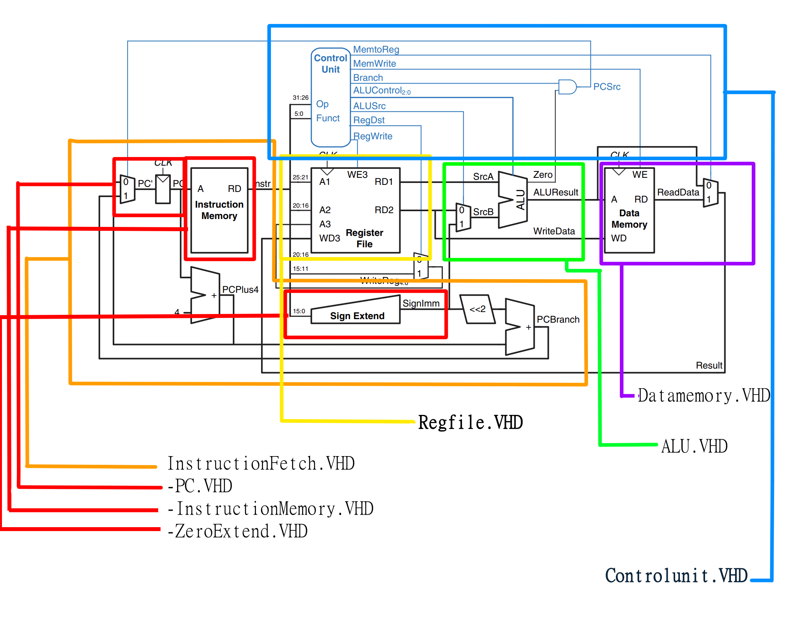

# Single Cycle MIPS-I Processor Using VHDL

## Project Overview

This project emulates a MIPS-I processor using VHDL on the Nexys A7-100T Trainer board.
The processor was designed to be a general purpose processor, capable of graphics rendering, instruction handling, memory handling, and a lot more. We programmed a file manager, a 3d spinning cube, and the Fibonacci Sequence visualization displayed through VGA all on the board. This project was originally a PlayStation 1 emulator which uses an R3000A chip that we modelled our processor by. The R3000A is a 32 bit, pipelined processor that uses the MIPS-I ISA. It features no level 1 cache and instead uses instruction cache and an on-chip cache controller. 

## Expected Behavior
When the FPGA is on and connected to a display through VGA, the Fibonacci Sequence Visualizer should be on the screen. It consists of many squares and sections flashing colors. The file manager uses the on-board buttons to toggle it on and move between our two programs. While the file manager is open, there will be a menu on the bottom of all 32 registers and their values. Once manuevered over to the Cube program, you will see a cube spinning about the z-axis. A register increments the phase angle of the cube which may result in a numerical overflow if the Cube program is left on for too long. 

### WARNING: The Fibonacci Sequence Visualizer shows bright flashing lights that may trigger discomfort or seizures. 

## Required Hardware and Attachments

Current hardware:
- Nexys A7-100T Trainer board
  

- VGA male to HDMI female connector
  
  
- VGA cable
  
  
- HDMI cable
  
  
- Micro USB-B power supply/programming cable
  
  
- External monitor
  
  
- On-board buttons

## System Design

Include:
 
- Processor architecture overview
- Major VHDL components/modules
- How instruction memory, control, datapath, registers, ALU, and VGA output connect
- How the included programs are stored and executed
- Any finite state machines, Boolean logic, or control diagrams

Our procesor is modelled off this single-cycle diagram. Each area highlighted is roughly what group of components it corresponds to. 

Suggested diagrams/images to add:
- High-level block diagram
- Datapath diagram
- Control unit diagram
- VGA output pipeline diagram
- Program flow diagram for the cube or Fibonacci visualization

Image placeholders:

```md


```

## Vivado Setup and Build Instructions
1. Open Vivado.
2. Create or open the project.
3. Add the `.vhd` source files found in the sources_1 folder.
4. Add the `.xdc` constraints file found in the constrs_1.
5. Select the Nexys A7-100T board. 
6. Run synthesis.
7. Run implementation.
8. Generate the bitstream.
9. Connect the Nexys board.
10. Program the board.
11. Connect the display and confirm output.

## Nexys Board Inputs and Outputs
Inputs:

- Clock: Two clocks in the system, one for the PC to know when to refresh and another for the VGA drivers.
- Reset: Multiple resets in the system to ensure that we can reset the board without having to flash the board again.
- Instr: Machine code stored in instruction memory. 
- Buttons: We use the on-board buttons to navigate between the different programs. 

Outputs:

- VGA red: 3 bit vector that tell the VGA cable to display red and they control the vibrancy of the color.
- VGA green: 3 bit vector that tell the VGA cable to display green and they control the vibrancy of the color.
- VGA blue: 2 bit vector that tell the VGA cable to display blue and they control the vibrancy of the color.
- VGA horizontal sync: VGA works similar to a CRT monitor and has sync times between writing the pixels row by row. 
- VGA vertical sync: VGA has dedicated sync times on when to move to a different column. 
  
There are hundreds of inputs and outputs in this system that work as both. Looking through `FPGAtop.VHD` or `MIPSmicroprocessor.VHD` will give a good idea of how signals interact across components. 
`   p: pc
    port map(
        clk   => clk,
        reset => rst,
        din   => pc_next,
        dout  => programc
    );

    i: instructionmemory
    port map(
        addr  => programc,
        program_select => program_select,
        instr => instr
    );

` 
This was pulled from `instructionfetch.vhd` and it shows how our CPU knows what instruction to perform next. We input the next address into the program counter so it can update on the next clock cycle and feed the current address into our instruction fetch so it can determine what to do with it. 

## Project Demonstration

Add images and/or videos of the project in action.

Include:
- Photo of the FPGA setup
- Photo or screenshot of the VGA output
- Video of the spinning cube
- Video or photo of the Fibonacci visualization
- Any debug/test output that helps explain the system

Media placeholders:

```md


[Spinning cube demo](docs/videos/cube-demo.mp4)
[Fibonacci demo](docs/videos/fibonacci-demo.mp4)
```

## Modifications and Original Contributions

Explain what code or project material was created, modified, or reused.

If the project was created from scratch:
- Summarize the design process
- Explain how the processor was built
- Explain how the VGA programs were created
- Describe the most important implementation decisions

Our original process was to create a Playstation 1 emulator on the FPGA. The Playstation 1 uses the R3000A as its main processor which simplified a lot of the choices we needed to make. It is a 32-bit pipelined processor that uses the MIPS-I ISA. We chose to make a 32 bit single-cycled processor that also uses the MIPS-I ISA. If time would have allowed, we would have created a pipelined processor instead but after implementing a fully working single cycle CPU, we realized that we had nowhere near enough time for a project this ambitious. We still wanted to showcase what our processor can do and how well it can handle what we throw at it. We chose to showcase this process through graphics handling. The Cube program uses a phase counter in $6. Each cycle it computes a triangle-wave approximation of sine and cosine into $8 and $9. Through the ALU, it can project the 3D coordinates on a 2D plane. The Fibonacci Sequence Visualizer stores the different numbers in $1-10 and feeds those into display generator for the VGA cable to convert into pixel data. 

One of the most important implementation decisions was to move from a word-based program counter to an instruction-based counter. They accomplish the same thing but instead of adding 4 to PC to start a new instruction, we just increment by 1. This also makes some of the branching math a lot easier and uses less shifts and resources on the program counter. Another decision was combining our control path and our decoder into one component. It allows us to send our signals and decode the instruction easier than making them separate components. Another decision we made was keeping a single-cycle processor instead of going to multi-cycle or pipelined. 

A decision we chose to save time with was using AI to code our programs. AI was used sparcely on our actual processor and all code is human-made. When it came time to show what our processor can do with programs, it made the most semse for us to use AI to push our processor to its fullest limit, which it does. Almost all of the on-board memory was taken up by picture data, until we optimized the Cube to use machine code instead and it is a call back to the graphics rendering we wished to see from our PS1 emulator. A lot of the logic gates are being used every clock cycle, more than we had seen on any lab for the class. The AI used is a mix between Gemini and ChatGPT for the programs generated. Ethically and educationally, we see no issue in AI being used for the programs as the goal of this project was to make a functional general purpose CPU. AI allows us to showcase our project in its full without having to stress about doing a separate project within our project. 

Also, `VGA_Sync.vhd` and `VGA_top.vhd` are originally from Lab 3. They were copied and pasted in full and were barely changed over the course of this project. 

## Code Organization

Describe how the repository is organized.

Fill in the purpose of each major file/folder:

```txt
/
├── README.md
├── sources_1/
|  ├── FPGA_top.vhd
|  ├── MIPSmicroprocessor.vhd
|  ├── alu.vhd
|  ├── clk_wiz_0.vhd
|  ├── clk_wiz_0_clk_wiz.vhd
|  ├── controlunit.vhd
|  ├── counter.vhd
|  ├── data_memory.vhd
|  ├── display_generator.vhd
|  ├── instructionfetch.vhd
|  |  ├── instructionmemory.vhd
|  |  └── pc.vhd
|  ├── leddec.vhd
|  ├── mux.vhd
|  ├── regfile.vhd
|  ├── signext.vhd
|  ├── vga_sync.vhd
|  └── vga_top.vhd
├── constraints/
│   ├── leddec.xdc
├── mips.png
├── FSM.png
└── ...
```

Mention:
Our processor imports almost everything into the top two modules, `FPGA_top.VHD` and `MIPSmicroprocessor.VHD` except for our instruction fetch top module. That uses
## Testing and Verification

Describe how the project was tested.

Include:
- Simulation tests performed
- Vivado synthesis/implementation results
- Board testing steps
- How the cube program was verified
- How the Fibonacci program was verified
- Bugs found during testing and how they were fixed

## Team Contributions

Summarize who was responsible for each part of the project.

| Team Member | Contributions |
| --- | --- |
| Jason | ALU, Memory, File Manager, Fibonacci Sequence, Display Generator, Constraints|
| Michael | Control Unit, Registers, Decoder, Cube, Display Generator, Fibonacci Sequence, Poster |
| Julian | Instruction Fetch, Instruction Memory, Documentation, Troubleshooting, PC, Documentation |

Github was not really used until after the processor was complete. The commits reflect the individual contribution of work done after the processor but a lot of the work prior was worked on together in class. The CPU component contributions reflect the responsibility of who contributed the most. 

## Project Timeline

Summarize the timeline of work completed.

| Date/Week | Work Completed |
| --- | --- |
| Week 1 | Project idea and initial design |
| Week 2 | Processor components |
| Week 3 | Processor components and debugging |
| Week 4 | VGA display |
| Week 5 | Testing and documentation |

## Difficulties and Solutions
We had issues on figuring out how much time it would take us for a PS1 emulator which resulted in us simplifying the project. We had issues making a testbench that accurately showed the values of the register and instructions being performed. It wasn't until we started testing on the physical board that we began fixing these problems. We could have done a better job organizing the project in hindsight but overall, we did not have many issues with this project. 

## Final Summary

Conclude with a short summary of:
- What was accomplished
- What worked successfully
- What could be improved in the future
- What was learned from the project

In conclusion, we created a general purpose single cycle processor that was able to open different programs and display 3D rendered graphics. Some future improvements on this project could be transtiioning it from single-cycle to pipelined, adding memory, adding I/O support, optimizing display_generator.vhd to use a framebuffer in data memory, optimizing the display to showcase tiles, and more. 
## Submission Checklist

- [ ] Project behavior is clearly described.
- [ ] Required hardware and attachments are listed.
- [ ] System diagrams/images are included.
- [ ] Vivado setup steps are documented.
- [ ] Nexys board inputs and outputs are described.
- [ ] Images/videos of the project are included.
- [ ] Starter code, modifications, and original contributions are explained.
- [ ] AI usage is cited.
- [ ] Team contributions are listed.
- [ ] Timeline is included.
- [ ] Difficulties and solutions are summarized.
- [ ] Code is organized into appropriate `.vhd` and `.xdc` files.
